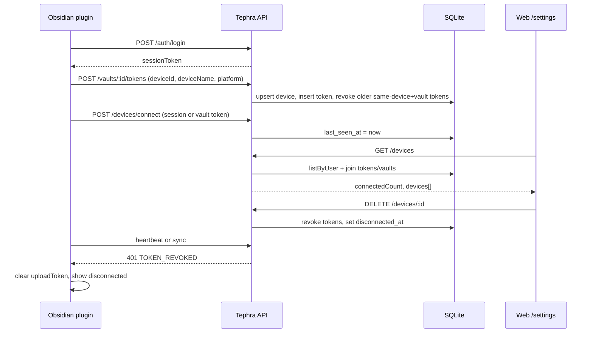

# Connected Obsidian clients and vault-token revocation

> **Status:** implementation plan
> **Target:** `.agents/plans/008-CONNECTED_CLIENTS_AND_TOKEN_REVOCATION.md`
> **Depends on:** `001-TEPHRA_STAGE1_PLAN.md`, `007-REIMAGINED_OBSIDIAN_PLUGIN.md`
> **Packages:** `tephra-server` (api, web, database, vault-model, protocol), `tephra-plugin`
> **Last updated:** 2026-09-06

---

## 1. Context and user outcome

The web Account page (`/settings`) currently has session, appearance, and a read-only-mirror note. Vault upload tokens live only on the per-vault Tokens tab. The database already has `devices` and `api_tokens`, but:

- There is no account-wide “connected clients” API or UI.
- A successful plugin connect is **not** recorded as activity except when minting a token or completing `POST …/sync/commit`.
- Sidecar-mode plugins (sync off) never bump `last_used_at`.
- Re-binding a vault mints a new `tpt_…` secret and leaves the previous one valid.
- “Disconnect this Obsidian install” does not exist; only per-token revoke on one vault.

**Outcome:** After an Obsidian plugin logs in and binds (or re-connects on load), the server persists that client. The Account settings page shows how many clients have connected, lists them, and lets the owner disconnect one. The same page lists vault tokens across vaults so older tokens can be revoked without opening each vault.

---

## 2. Product decisions

| Term | Meaning |
| --- | --- |
| **Client** | One Obsidian plugin installation = one `devices` row (`device_${uuid}` from the plugin). |
| **Connected** | The device has at least one **active** vault token (`revokedAt` and `expiresAt` allow use). |
| **Disconnect** | Soft-revoke every vault token for that device and set `disconnected_at`. Do **not** delete the device (revisions FK `vault_revisions.device_id`). Do **not** kill the plugin’s login session, so the user can re-bind from Obsidian. |
| **Logged connection** | Upsert the device and update `last_seen_at` (and token `last_used_at` when a vault token is used). First connect is `created_at`. No append-only event log. |

**Settings surface:** the Account page at `/settings` (`SettingsPage.tsx`), not the gear Appearance modal.

**Counts shown:** “N connected now” and “M clients have connected” (`M` = device rows for this user).

---

## 3. Scope and non-goals

### In scope

- Persist plugin connect/heartbeat in SQLite (`devices` + token last-used).
- Session-authenticated list/disconnect APIs for the current user’s clients.
- Account-wide vault-token list and revoke (reuse existing per-vault DELETE).
- Auto-revoke previous active tokens for the same `(deviceId, vaultId)` when the plugin re-binds.
- Plugin: heartbeat on bind and on load; treat `TOKEN_REVOKED` as disconnected and clear the local upload token.
- Enrich the existing vault Tokens tab with last-used / device / revoked state.
- Fix the web create-token response mismatch (`value` vs `token`) so TokenManager shows the real secret.

### Non-goals

- Web-to-vault writes, merging, or plugin execution (Stage 1).
- Live WebSocket presence, IPs, user-agents, or geolocation.
- Browser-session device list / logout-all (plan 002).
- Hard-deleting devices or tokens.
- Operator admin of other users’ clients.
- Pushing a disconnect into a running Obsidian process (plugin learns on the next heartbeat/sync).

---

## 4. Invariants and security

1. Never return or log `tokenHash`, raw `tpt_…` / `tps_…` secrets, passwords, or vault file contents.
2. List/disconnect/revoke require a **browser or plugin session** (`requireSession`). Upload tokens cannot manage other clients.
3. A user may only see/disconnect **their** devices and tokens.
4. Cross-user `deviceId` reuse remains `403 VAULT_ACCESS_DENIED`.
5. Disconnect is token revocation, not row deletion. Historical revisions keep their `device_id`.
6. After disconnect, `authenticate()` already returns `401 TOKEN_REVOKED` for those hashes.
7. Re-bind from the plugin mints a new token, clears `disconnected_at`, and invalidates older tokens for that device+vault.
8. Shared packages stay browser-safe; SQLite/fs stay in Node adapters.
9. Throttle `last_seen_at` / `last_used_at` writes to at most once per 5 minutes per device/token to avoid write amplification on sync/plan.

---

## 5. Current code (do not reinvent)

| Already exists | Gap |
| --- | --- |
| `devices` + `api_tokens` in `001_initial.sql` | No `disconnected_at` / `plugin_version`; no token indexes by user/device |
| `devices.listByUser` | Unused by HTTP |
| `GET/POST/DELETE /vaults/:id/tokens` | Vault-scoped only; list omits a public DTO; no account-wide list |
| Token mint upserts device | Login and sidecar use do not |
| `lastUsedAt` on **commit only** | Not on connect, plan, or GET vault |
| `TokenManager` per vault | Not on `/settings`; no last-used; create-secret field is wrong (`token` vs API `value`) |
| Plugin `provisionVaultToken(deviceId, deviceName, platform: 'obsidian-plugin')` | Re-bind does not revoke the previous secret; no heartbeat |

---

## 6. Architecture



Disconnect vs token revoke:

```text
Disconnect client  → revoke ALL active tokens for that device_id
Revoke one token   → that secret dies; device stays connected if another active token remains
Re-bind plugin     → new token; older tokens for that device+vault revoked
```

---

## 7. Schema and repository changes

### 7.1 Migration runner

`openSqliteDatabase` currently applies only `001_initial.sql` and hard-codes `PRAGMA user_version = 1`. Generalize:

- Discover numbered files in `tephra-server/migrations/sqlite/`.
- Apply any file whose prefix is `> current user_version` in order, each in a transaction, then set `user_version` to that prefix.
- Fail fast if `user_version` is newer than the latest bundled file (existing behavior, bumped to 2).

Never edit `001_initial.sql`.

### 7.2 `002_client_connections.sql`

```sql
PRAGMA foreign_keys = ON;

ALTER TABLE devices ADD COLUMN plugin_version TEXT;
ALTER TABLE devices ADD COLUMN disconnected_at INTEGER;

CREATE INDEX IF NOT EXISTS api_tokens_user_idx ON api_tokens(user_id);
CREATE INDEX IF NOT EXISTS api_tokens_device_idx ON api_tokens(device_id);
```

### 7.3 Domain types (`packages/vault-model`)

```ts
export interface Device {
  id: string;
  userId: string;
  name: string;
  platform?: string;
  pluginVersion?: string;
  createdAt: number;
  lastSeenAt: number;
  disconnectedAt: number | null;
}
```

### 7.4 Repositories (`packages/database/core` + sqlite + MemoryDatabase in tests)

**`ApiTokenRepository`** add:

- `listByUser(userId: string): Promise<ApiToken[]>`
- `listByDevice(deviceId: string): Promise<ApiToken[]>`

**`DeviceRepository`:** keep insert/update/list; **do not add delete**.

SQLite row mapper must read the new columns (NULL → `disconnectedAt: null`). INSERT/UPDATE bind the extra columns.

---

## 8. API changes (`apps/api/src/app.ts`)

Extract a shared `upsertOwnedDevice(...)` used by token mint, connect, and commit.

### 8.1 `POST /api/v1/devices/connect`

Auth: session **or** vault token.

Body:

```ts
{
  deviceId: string;           // 1–200, required
  deviceName?: string;        // 1–200
  platform?: string;          // default "obsidian-plugin"
  pluginVersion?: string;     // from X-Tephra-Plugin-Version if omitted
}
```

Behavior:

1. Ownership check (same as token mint).
2. Insert or update device; set `lastSeenAt = now`, clear `disconnectedAt`.
3. If principal is a vault token bound to this device, touch `lastUsedAt` (5‑minute throttle).
4. Return `{ device: publicDevice }`.

This is the “successful connect is logged” write path for sidecar mode and plugin load.

### 8.2 `GET /api/v1/devices`

Session only.

Response (never includes hashes):

```ts
{
  connectedCount: number;
  totalCount: number;
  devices: Array<{
    id: string;
    name: string;
    platform: string | null;
    pluginVersion: string | null;
    createdAt: number;
    lastSeenAt: number;
    disconnectedAt: number | null;
    connected: boolean;
    activeTokenCount: number;
    vaults: Array<{ vaultId: string; vaultName: string }>;
  }>;
}
```

`connected` = `disconnectedAt === null` **and** `activeTokenCount > 0`.

Sort: connected first, then `lastSeenAt` desc.

### 8.3 `DELETE /api/v1/devices/:deviceId`

Session only. 404 if missing or not owned (`DEVICE_NOT_FOUND` — add to `apiErrorCodeSchema`).

In a transaction:

1. Load device; 404 if wrong user.
2. Soft-revoke every active token with that `device_id` (`revokedAt = now`).
3. Set `disconnectedAt = now`.
4. 204.

Do not revoke the caller’s browser session.

### 8.4 `GET /api/v1/tokens`

Session only. Account-wide list via `apiTokens.listByUser`, join vault name + device name, **strip `tokenHash`**.

Include revoked tokens so “older” ones remain visible and labelled.

### 8.5 Token mint (`POST /vaults/:vaultId/tokens`)

After insert, revoke other **active** tokens with the same `(deviceId, vaultId)` except the new id. Re-bind no longer stacks live secrets.

Return shape stays `{ token: publicToken, value: raw }` (plugin already uses `value`).

### 8.6 Touch last-used on more than commit

When a vault token authenticates successfully, update `lastUsedAt` and the linked device `lastSeenAt` if older than 5 minutes. Apply in `authenticate()` or immediately after for token principals (skip session cookies). Commit path can keep its existing write; throttle makes double-write cheap.

### 8.7 Enrich `GET /vaults/:vaultId/tokens`

Add `deviceName` (join devices) on the public token object so the vault Tokens tab can show it without a second request.

---

## 9. Plugin changes (`tephra-plugin`)

1. `TephraClient.connectDevice(...)` → `POST /api/v1/devices/connect`.
2. After `provisionAndBindVault`, call connect with session token, `deviceId`, `deviceName`, `platform: 'obsidian-plugin'`, `PLUGIN_VERSION`.
3. On `onload` / layout-ready, if `auth.sessionToken` or `uploadToken` and `deviceId` exist, heartbeat once (session preferred).
4. Optional 15-minute interval while the plugin is loaded so sidecar mode stays “connected”.
5. On `401` / `TOKEN_REVOKED` from connect or sync: clear `uploadToken` (keep session + vaultId), status `auth-error` / “Disconnected from Tephra. Re-link this vault.”, Notice.
6. Settings: show last known bind; a local “Unlink vault” that clears `uploadToken`/`vaultId` without server disconnect (server disconnect remains a settings-page action).

Do not send vault contents or the raw token in connect body.

---

## 10. Web UI

### 10.1 Account page (`SettingsPage.tsx`)

Two new `settings-card` sections **above** Appearance:

**Connected clients**

- Heading + counts: “3 connected” / “5 have connected”.
- Empty: “No Obsidian clients have connected yet.”
- Row: name, platform, vault names, last seen, created, Connected/Disconnected badge.
- **Disconnect** (`danger subtle`) with confirm: “Revoke upload access for {name}? The plugin must re-link to sync again.”
- Disabled when already disconnected and `activeTokenCount === 0`.

**Vault tokens**

- Table/list across vaults: name, vault, device, created, last used (or “Never”), Revoked badge.
- **Revoke** per active token (existing DELETE).
- Optional “Revoke unused” for tokens with `lastUsedAt === null` and a newer sibling on the same vault — nice-to-have; individual revoke is required.

Reuse `.token-list`, `.danger.subtle`, `.eyebrow`. Add `.badge` / muted timestamps; check desktop and mobile (`page.narrow`).

New components (keep `SettingsPage` thin):

- `ConnectedClientsCard`
- `VaultTokensCard` (account-wide)

### 10.2 Vault Tokens tab

Show last used, device name, revoked. Keep create+copy. **Fix** `CreatedToken` to `{ token: {…}, value: string }` matching the API (today TokenManager reads `created.token` as the secret; tests mock the wrong shape).

### 10.3 Web client

```ts
devices(): Promise<DevicesResponse>
connectDevice is plugin-only
disconnectDevice(id): DELETE /devices/:id
accountTokens(): GET /tokens
revokeToken(vaultId, tokenId) // existing
```

Extend `ApiToken` with `vaultId`, `vaultName`, `deviceId`, `deviceName`, `lastUsedAt`, `revokedAt`.

---

## 11. Ordered implementation steps

Independent file ownership where noted.

| Phase | Work | Primary files |
| --- | --- | --- |
| **1. Persistence** | Sequential migrations; `002`; Device fields; `listByUser` / `listByDevice`; sqlite tests | `migrations/sqlite/`, `database/core`, `database/sqlite`, `vault-model` |
| **2. API** | upsert helper, connect/list/disconnect, account tokens, mint revokes siblings, last-used throttle, `DEVICE_NOT_FOUND` | `apps/api/src/app.ts`, `packages/protocol`, `apps/api/tests/app.test.ts` + MemoryDatabase |
| **3. Plugin** | connect client, heartbeat, TOKEN_REVOKED unlink | `tephra-plugin/src/api/client.ts`, `main.ts`, `settings-tab.ts`, `coordinator.ts`, plugin tests |
| **4. Web** | types/client, Settings cards, TokenManager fix, CSS | `apps/web/src/**`, `token-manager.test.tsx`, new settings tests |
| **5. Verify** | `npm run check`; browser exercise of `/settings` | — |

Phase 1 can land before 2. Phase 3 and 4 depend on 2 but can proceed in parallel after the API contract is written.

---

## 12. Tests

**SQLite:** migrate 0→1→2; new columns; `listByUser` / `listByDevice`; unique token hash unchanged.

**API (`app.test.ts`):**

- Connect with session creates/updates device and `lastSeenAt`.
- Connect with vault token touches `lastUsedAt`.
- GET `/devices` counts and omits hashes; other user sees empty.
- DELETE disconnects: tokens `revokedAt` set; subsequent sync `401 TOKEN_REVOKED`.
- Re-mint for same device+vault revokes the previous token; new secret works.
- GET `/tokens` lists all vaults, stripped hashes.
- Cross-user deviceId still 403.

**Plugin:** `connectDevice` URL/body/Authorization; 401 clears upload token (unit).

**Web:** clients empty/list/disconnect confirm; token list revoke; TokenManager copies `value`.

**Regression:** existing bootstrap/login/token/commit tests still pass.

No vault-content assertions in logs.

---

## 13. Verification commands

```text
npm run check
```

Manual / browser (required for the settings UI):

1. Bootstrap + login in the web app.
2. From the plugin: login, create/bind vault (sync on and off).
3. `/settings`: counts increment; client row shows name + last seen.
4. Disconnect → plugin next heartbeat/sync fails; web list shows Disconnected.
5. Re-link in plugin → connected again; old token on Tokens tab is Revoked.
6. Revoke an older token individually; other clients unaffected.
7. Desktop and ~375px width on `/settings` and `/v/:id/tokens`.

---

## 14. Compatibility, deployment, rollback

- Additive SQLite migration; existing DBs upgrade on startup via `user_version` 1→2.
- Old plugins that never call `/devices/connect` still appear once they mint a token or commit (weaker last-seen until they upgrade).
- Disconnect is reversible only by minting a new token (re-bind); raw secrets are gone.
- Rollback: keep v2 columns (SQLite cannot cheaply DROP COLUMN in old versions); revert API/UI. Columns are nullable and unused if code rolls back.
- Single-node SQLite: no extra infra.
- Railway/volume installs pick up the migration on container start.

---

## 15. Completion checklist

- [x] Plan stored as `.agents/plans/008-CONNECTED_CLIENTS_AND_TOKEN_REVOCATION.md`
- [ ] Migration runner + `002_client_connections.sql`
- [ ] Repository methods and MemoryDatabase mocks
- [ ] `POST /devices/connect`, `GET /devices`, `DELETE /devices/:id`, `GET /tokens`
- [ ] Re-bind revokes older same-device+vault tokens
- [ ] Settings page: counts, list, disconnect, account-wide token revoke
- [ ] Plugin heartbeat + TOKEN_REVOKED handling
- [ ] TokenManager secret uses API `value`
- [ ] Tests above + `npm run check`
- [ ] Browser verification of `/settings` (desktop + mobile)
- [ ] README / GETTING_STARTED one-liner: disconnect clients from Account settings
- [ ] `PROGRESS.md` only after verified
